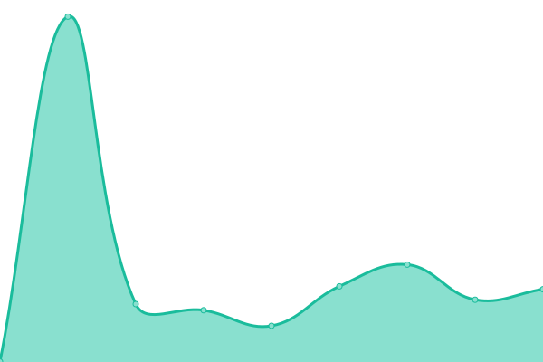

# [📈 Live Status](https://uptime.yanghumkwan.pt): <!--live status--> **🟧 Partial outage**

This repository contains the open-source uptime monitor and status page for [Associação Portuguesa de Hapkido Yang Hum Kwan](https://yanghumkwan.pt), powered by [Upptime](https://github.com/upptime/upptime).

With [Upptime](https://upptime.js.org), you can get your own unlimited and free uptime monitor and status page, powered entirely by a GitHub repository. We use [Issues](https://github.com/YangHumKwan/upptime/issues) as incident reports, [Actions](https://github.com/YangHumKwan/upptime/actions) as uptime monitors, and [Pages](https://demo.upptime.js.org) for the status page.

<!--start: status pages-->
<!-- This summary is generated by Upptime (https://github.com/upptime/upptime) -->
<!-- Do not edit this manually, your changes will be overwritten -->
<!-- prettier-ignore -->
| URL | Status | History | Response Time | Uptime |
| --- | ------ | ------- | ------------- | ------ |
|  [Public Website](https://yanghumkwan.pt) | 🟩 Up | [public-website.yml](https://github.com/YangHumKwan/upptime/commits/HEAD/history/public-website.yml) | 

 314ms
     
 | 

<a href="https://uptime.yanghumkwan.pt/history/public-website">100.00%</a>
    

|  [Isna API](https://isna.yanghumkwan.pt/api/v1/health/check) | 🟥 Down | [isna-api.yml](https://github.com/YangHumKwan/upptime/commits/HEAD/history/isna-api.yml) | 

 501ms
     
 | 

<a href="https://uptime.yanghumkwan.pt/history/isna-api">69.91%</a>
    

<!--end: status pages-->

[**Visit our status website →**](https://uptime.yanghumkwan.pt)

## 📄 License

- Powered by: [Upptime](https://github.com/upptime/upptime)
- Code: [MIT](./LICENSE) © [Associação Portuguesa de Hapkido Yang Hum Kwan](https://yanghumkwan.pt)
- Data in the `./history` directory: [Open Database License](https://opendatacommons.org/licenses/odbl/1-0/)
